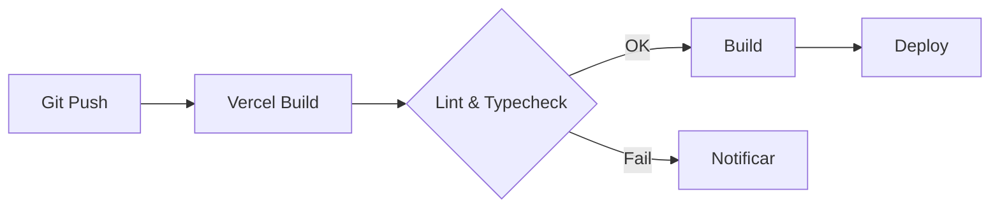

# Deploy - Visual ERP

## Ambientes

| Ambiente | URL | Database | Propósito |
|----------|-----|----------|-----------|
| Development | `http://localhost:3000` | PostgreSQL local | Desenvolvimento |
| Staging | `https://staging.visualerp.com.br` | Supabase staging | Homologação |
| Production | `https://app.visualerp.com.br` | Supabase production | Produção |

## Pré-requisitos

- Node.js 20+
- npm 10+
- Conta Vercel
- Conta Supabase (3 projetos: dev, staging, prod)
- Domínio configurado

## Deploy na Vercel

### 1. Preparação

```bash
# Verificar build local
npm run build

# Verificar lint
npm run lint

# Verificar typescript
npm run typecheck

# Verificar testes
npm run test
```

### 2. Configuração no Vercel Dashboard

1. Importar repositório do GitHub
2. Configurar **Framework**: Next.js
3. **Build Command**: `npm run build`
4. **Output Directory**: `.next/`
5. Configurar variáveis de ambiente (ver `ENVIRONMENT.md`)

### 3. Domínio

1. Adicionar domínio no Vercel Dashboard
2. Configurar DNS (CNAME apontando para `cname.vercel-dns.com`)
3. SSL automático via Vercel

## Supabase

### 1. Criar Projeto

1. Acessar [Supabase Dashboard](https://supabase.com)
2. Criar projeto para cada ambiente
3. Anotar URL e chaves (anon + service_role)

### 2. Configurar Auth

1. Settings → Authentication → Providers → Email
2. Configurar redirect URLs:
   - Development: `http://localhost:3000/**`
   - Staging: `https://staging.visualerp.com.br/**`
   - Production: `https://app.visualerp.com.br/**`

### 3. Executar Migrations

```bash
# Aplicar migrations no banco de produção
npx prisma migrate deploy

# Gerar Prisma Client
npx prisma generate
```

### 4. Storage

1. Criar bucket: `visual-erp-uploads`
2. Configurar políticas de acesso (RLS)
3. Configurar CORS se necessário

## Pipeline de Deploy



## Health Check

```http
GET /api/health

HTTP/1.1 200 OK
Content-Type: application/json

{
  "status": "ok",
  "version": "1.0.0",
  "database": "connected",
  "uptime": "3600s",
  "timestamp": "2026-07-22T12:00:00.000Z"
}
```

## Rollback

```bash
# Código
git revert HEAD
git push origin main

# Database
npx prisma migrate down

# Vercel
# Dashboard → Deployments → ⋮ → Promote to Production
```

## Variáveis de Ambiente por Ambiente

Ver [ENVIRONMENT.md](ENVIRONMENT.md) para a lista completa de variáveis e seus valores por ambiente.

## Checklist Pré-Deploy

### Funcional
- [ ] Login e logout funcionando
- [ ] CRUD de usuários
- [ ] CRUD de clientes
- [ ] CRM (leads, visitas)
- [ ] Orçamentos
- [ ] Projetos e tarefas
- [ ] Ordens de serviço
- [ ] Produção
- [ ] Financeiro (receber, pagar, fluxo)
- [ ] Dashboard com dados

### Técnico
- [ ] `npm run lint` — sem erros
- [ ] `npm run typecheck` — sem erros
- [ ] `npm run build` — compilado com sucesso
- [ ] `npm run test` — todos passando
- [ ] Cobertura ≥ 75%
- [ ] Prisma migrate deploy executado
- [ ] Prisma generate executado
- [ ] Health Check funcional
- [ ] Variáveis de ambiente configuradas
- [ ] Headers de segurança ativos
- [ ] Backup configurado
